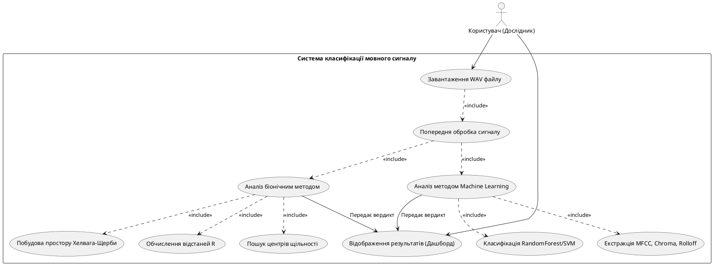
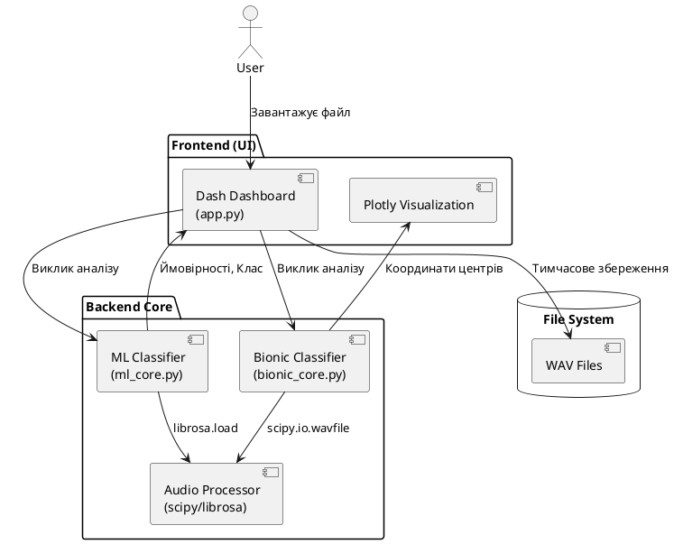

# Технічна документація ККП: Реалізація та Архітектура

У цьому файлі зібрано повний опис реалізації, архітектурні діаграми та специфікацію (SRS), які були згенеровані для проєкту "Програмна система бінарної класифікації мовного сигналу за критерієм «Людина-ШІ»".

---

## 1. Структура проєкту
Проєкт організований згідно з принципами модульності та розділення відповідальності (Separation of Concerns):
- `src/bionic_core.py` — математична реалізація біонічного алгоритму.
- `src/ml_core.py` — обгортка для класичних алгоритмів машинного навчання.
- `src/app.py` — графічний інтерфейс на базі Plotly Dash.
- `docs/` — технічна документація та UML-схеми.

---

## 2. UML Діаграми (PlantUML)

### Діаграма Прецедентів (Use Case Diagram)

### Діаграма Компонентів (Component Diagram)

---

## 3. Специфікація Програмного Забезпечення (SRS)

**1. ВСТУП**
Система використовує гібридний підхід, що поєднує біонічний метод та класичне машинне навчання для ідентифікації штучно згенерованого мовлення.

**2. ФУНКЦІЇ ПРОДУКТУ**
- Завантаження WAV (22050 Hz, Mono).
- Координатно-топологічне відображення фонем.
- Класифікація за біонічним порогом (R=16).
- ML-класифікація (MFCC + Random Forest).
- Візуалізація результатів.

**3. КОНКРЕТНІ ВИМОГИ**
- **UI:** Веб-дашборд Dash з темною темою.
- **Стек:** Python 3.9+, librosa, scipy, scikit-learn.
- **Швидкодія:** Аналіз 10с аудіо < 5с.

---

## 4. Опис реалізації модулів

### Біонічне ядро (`bionic_core.py`)
Реалізує алгоритм ковзного вікна для пошуку центрів щільності точок у просторі (v1, v2). Обчислює середню відстань R між центрами. Висока варіативність (R > 16) свідчить про людське мовлення.

### ML ядро (`ml_core.py`)
Використовує бібліотеку `librosa` для отримання спектральних характеристик. MFCC коефіцієнти дозволяють вловити тонкі відмінності в тембрі та "металеві" артефакти ШІ.

### Веб-інтерфейс (`app.py`)
Забезпечує інтерактивну взаємодію. Дозволяє завантажувати файли та миттєво бачити порівняння двох методів на графіках.
